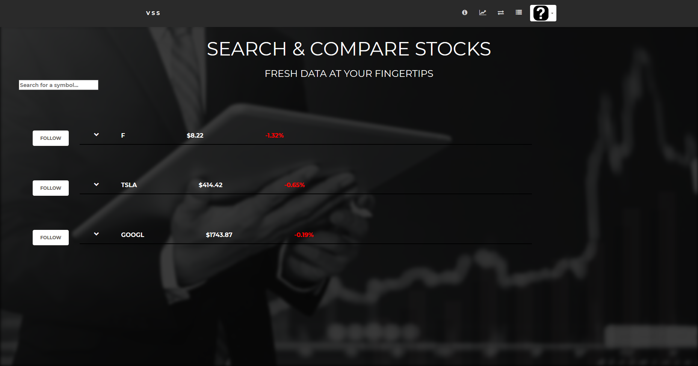

# virtual-stock-sim
Virtual Stock Sim (VSS) is a stock market and investment simulation site.  
VSS uses real-world market data gathered and updated periodically from Yahoo Finance's API for stock's prices. 
Users are able to follow, buy, and sell stock shares and track their investments returns.  

## Site Pictures
### Landing Page

### Stock Searching

### Investments

### Sign-In

### Account

### Error Pages

